# Hi, I'm Hasan Mahmud 👋

<picture>
  <source media="(prefers-color-scheme: dark)" srcset="./dark.svg">
  <source media="(prefers-color-scheme: light)" srcset="./light.svg">
  
</picture>

  <b>BCA Student · Full-Stack Developer · DSA Learner · Tech Enthusiast</b>

  🐍 Python &nbsp;·&nbsp; ⚛️ React &nbsp;·&nbsp; 🟢 Node.js &nbsp;·&nbsp; 🟨 JavaScript
  &nbsp;·&nbsp; ☕ Java &nbsp;·&nbsp; 🗄️ MySQL / MongoDB &nbsp;·&nbsp; 🐧 Linux &nbsp;·&nbsp; 🐳 Docker

I'm a **BCA student (2024–2027)** focused on **full-stack development, DSA, backend systems, databases, Linux and DevOps fundamentals**.

## 🎓 About Me

- 🎓 BCA, **2024–2027**
- 📈 Current CGPA: **9.22**
- 💻 Interested in **Full-Stack Development** and software engineering
- 🧠 Practising **DSA and problem solving** with Python / Java
- 🚀 Building real-world web and backend projects
- 🌱 Currently improving **React, Node.js, SQL, REST APIs, Linux and DevOps**

## 💼 Experience

### Web Development Intern — Amdox Technology
**Remote · 3 Months**

- Working on web development tasks and practical software development workflows
- Building and improving frontend/backend development skills
- Working with modern development tools and Git/GitHub

## 🧩 Featured Projects

### 🍔 Zomato Clone — Microservices Based
A full-stack food delivery project built around a microservices architecture.

- React / TypeScript frontend
- Node.js backend services
- MongoDB
- Authentication and service separation
- RabbitMQ-based communication
- Customer, restaurant, rider and admin flows

### 📷 QR Code Attendance System
A Python/Flask based attendance project using QR-code scanning and webcam integration.

- Python
- Flask
- QR code processing
- Database-backed attendance workflow

## 🛠️ Engineering Stack

### Languages
`Python` `Java` `JavaScript` `C++` `PHP`

### Frontend
`HTML` `CSS` `JavaScript` `React` `Bootstrap` `TypeScript`

### Backend
`Node.js` `Express.js` `PHP` `Flask` `REST APIs`

### Databases
`MySQL` `MongoDB`

### DevOps / Tools
`Linux` `Docker` `Git` `GitHub` `VS Code` `PowerShell`

### Currently Learning
`DSA` `SQL` `React` `Node.js` `REST API` `DevOps` `Cloud`

## 📊 GitHub Activity

  

<h2 align="center">Contribution Activity 🐍</h2>

  <picture>
    <source media="(prefers-color-scheme: dark)" srcset="https://raw.githubusercontent.com/hasawork01/github-snake/output/github-snake-dark.svg">
    <source media="(prefers-color-scheme: light)" srcset="https://raw.githubusercontent.com/hasawork01/github-snake/output/github-snake.svg">
    
  </picture>

## 📫 Connect With Me

  💻 <a href="https://github.com/hasawork01">GitHub</a> 
  💼 LinkedIn — add your LinkedIn URL here

> **Keep learning. Keep building. Keep improving. 🚀**
